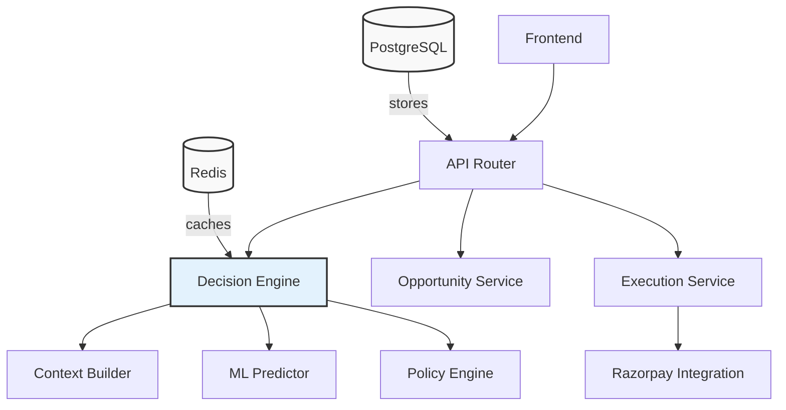

# REVIVE

**Autonomous Revenue Recovery & Decision Engine**

> Don't just detect lost revenue. Decide how to recover it.

REVIVE is a payment‑recovery system built for the **Razorpay Buildathon**. Instead of applying a single retry strategy to every failed payment, REVIVE analyzes the payment context, predicts the expected effectiveness of different recovery actions, evaluates counterfactual outcomes, applies merchant policies and guardrails, and selects the action with the highest expected net recovery. It can then execute supported actions through Razorpay Test Mode and use real payment webhooks to close the loop and measure resulting recovery.

---

## The Problem

A failed payment does not necessarily mean permanently lost revenue.

Different failures require different interventions:

- retry immediately
- retry later
- send a reminder
- create a payment link
- suggest an alternate payment method
- or take no action

A naive strategy such as **ALWAYS_RETRY** can recover revenue, but may unnecessarily intervene on customers when a different action would be more effective.

REVIVE treats recovery as a **decision optimization problem**:

```text
Expected Net Recovery =
    Expected Recovered Amount
  - Intervention Cost
  - Customer Friction Cost
  - Risk Penalty
```

---

## Architecture

REVIVE is a modular Python backend (FastAPI) that connects to a PostgreSQL database and a Redis cache. The diagram below illustrates the major components and data flow.

### High‑level diagram



### Component details

| Layer | Responsibility |
|-------|-----------------|
| **API** | FastAPI endpoints under `/api/v1/recovery`: decide, list/get opportunities, execute, actions, outcome |
| **Decision Engine** | Computes scored actions (retry, payment link, reminder, etc.) using ML predictions, timing curves, friction/risk costs, and merchant policies; selects highest‑NEV action |
| **Recovery Service** | Orchestrates decision, persists `RecoveryOpportunity` + `RecoveryAction` rows, generates explanations |
| **Policy Engine** | Validates actions against merchant policies (max recovery amount, allow payment links, etc.) |
| **ML Predictor** | Trained gradient‑boosting model that predicts recovery probability per action |
| **Context Builder** | Constructs feature row from payment, customer, merchant, and attempt history |
| **Integration (Razorpay)** | Provides execution channel for `CREATE_PAYMENT_LINK` in test mode; handles webhooks |
| **Database** | PostgreSQL stores payments, customers, merchants, recovery opportunities, actions, outcomes, model predictions |
| **Cache** | Redis used for short‑lived data (e.g., webhook pending state) |

---

## Getting Started

### Prerequisites

- **Docker** & **Docker Compose** (recommended) – brings up PostgreSQL, Redis, and the backend.
- **Python 3.10+** (if running locally without Docker).
- **uv** or **pip** for dependency management.

### Using Docker (recommended)

1. **Clone the repo** (if not already)
   ```bash
   git clone https://github.com/your-org/revive.git
   cd revive
   ```

2. **Start the infrastructure**
   ```bash
   docker compose up -d
   ```
   This spins up:
   - `postgres` – PostgreSQL `revive` database
   - `redis` – Redis instance
   - `backend` – FastAPI application on `http://localhost:8000`
   - `frontend` – (optional) UI on `http://localhost:3000`

3. **Verify services are healthy**
   ```bash
   docker compose ps
   ```
   All services should show `healthy`.

4. **Seed a demo payment** (creates one FAILED ₹15 000 `TEMPORARY_BANK_FAILURE` payment in the Docker DB)
   ```powershell
   # From the project root
   docker compose exec backend python -m app.seed_e2e
   # => prints PAYMENT_ID=<id>
   ```

5. **Run the REVIVE decision flow** so the opportunity appears in the frontend
   ```powershell
   # Replace <PAYMENT_ID> with the ID from the previous step
   curl -X POST "http://localhost:8000/api/v1/recovery/decide" \
       -H "Content-Type: application/json" -d '{"payment_id": <PAYMENT_ID>}'
   ```

6. **View opportunities**
   ```bash
   curl "http://localhost:8000/api/v1/recovery/opportunities"
   ```
   The newly created opportunity will be listed and visible in the frontend UI.

### Local development (without Docker)

1. **Install dependencies**
   ```bash
   cd backend
   pip install -r requirements.txt
   ```

2. **Set up environment variables** – copy `.env.example` to `.env` and fill in values (Razorpay keys, etc.)

3. **Start PostgreSQL and Redis** locally (or ensure they are running).

4. **Initialize the database**
   ```bash
   cd backend
   python -m app.db.init_db   # creates all tables
   ```

5. **Seed a demo payment**
   ```bash
   python scripts/seed_e2e.py   # creates one FAILED payment with timestamp tag
   ```

6. **Run the backend**
   ```bash
   uvicorn app.main:app --port 8000 --reload
   ```

7. **Execute the decision flow** as in the Docker steps above.

---

## API Reference

| Endpoint | Method | Auth | Description |
|----------|--------|------|-------------|
| `/api/v1/recovery/decide` | `POST` | none (Depends) | Run the full decision pipeline for a failed payment. Body: `{ "payment_id": <int> }`. Returns a `DecisionResponse` with recommended action, expected recovery, risk level, etc. |
| `/api/v1/recovery/opportunities` | `GET` | none | List recovery opportunities, optional query `status` filter, `limit`, `offset`. |
| `/api/v1/recovery/opportunities/{id}` | `GET` | none | Retrieve a single opportunity with its actions and outcome. |
| `/api/v1/recovery/{id}/execute` | `POST` | none | Execute the selected recovery action for an opportunity. |
| `/api/v1/recovery/{id}/actions` | `GET` | none | List all scored actions for an opportunity. |
| `/api/v1/recovery/{id}/outcome` | `GET` | none | Retrieve the most recent outcome for an opportunity. |

See the **`app/api/v1/recovery.py`** source for full request/response models.

---

## Decision Flow (Step‑by‑step)

1. **POST /recovery/decide** receives a `payment_id`.
2. The **Decision Engine** builds a feature row from the payment, customer, and merchant context.
3. For each candidate action (`DO_NOTHING`, `RETRY_NOW`, `RETRY_LATER`, `CREATE_PAYMENT_LINK`, `ALTERNATE_PAYMENT_METHOD`, `SEND_REMINDER`):
   - An ML model predicts a base recovery probability.
   - A timing multiplier is applied.
   - Friction cost, action cost, and risk penalty are subtracted to compute **Expected Net Value (NEV)**.
   - The **Policy Engine** validates the action against the merchant’s policy (e.g., `max_recovery_amount`, `allow_payment_links`).
   - The action’s policy validity and rejection reasons are recorded.
4. The action with the highest NEV among policy‑valid actions is selected as the **recommended action**.
5. **Recovery Service** persists a `RecoveryOpportunity` row and one `RecoveryAction` per candidate, then returns a `DecisionResponse`.
6. The frontend can display the recommendation, or the operator can call **POST /recovery/{opportunity_id}/execute** to trigger the action (e.g., create a payment link via Razorpay Test Mode).

---

## Tech Stack

| Layer | Technology |
|-------|------------|
| **Backend** | Python 3.11, FastAPI, SQLAlchemy 2.x (async‑aware), psycopg3 |
| **Database** | PostgreSQL 16 (Docker `revive` DB) |
| **Cache** | Redis 7 (optional, used for webhook pending state) |
| **ML** | Custom gradient‑boosting predictor (serialized via `ml/predictor/registry.py`) |
| **Containerisation** | Docker + Docker Compose |
| **Testing** | `pytest` suite under `backend/tests/` |
| **Other** | python-dotenv, pydantic‑settings, alembic (future migrations) |

---

## Project Structure (selected)

```
revive/
├── backend/
│   ├── app/
│   │   ├── api/           # FastAPI routes
│   │   ├── db/            # Session, engine, init_db
│   │   ├── models/        # SQLAlchemy models (catalog, recovery, ops)
│   │   ├── services/      # Decision, recovery, explanation, context
│   │   ├── policies/      # Policy engine
│   │   ├── ml/            # Predictor registry
│   │   └── core/          # Config (Settings)
│   ├── scripts/           # seed_e2e.py, seed_database.py, generate_data.py
│   ├── data/              # synthetic CSVs (generated by generate_data.py)
│   ├── tests/             # pytest tests
│   ├── Dockerfile
│   └── requirements.txt
├── docker-compose.yml
├── .env.example
├── Makefile               # convenience targets (seed, demo, train, evaluate)
├── ml/
│   ├── training/
│   └── evaluation/
├── frontend/              # (optional) Next.js/Vite frontend
├── README.md              # ← this file
└── docs/
```

---

## Contributing

1. Fork the repo and create a feature branch (`git checkout -b feature/...`).
2. Run the existing test suite to ensure nothing breaks (`make test`).
3. Add/seed a demo payment if your change alters payment handling; remember to use the **Docker** path (`docker compose exec backend ...`) so the data lives in the same DB the CI uses.
4. Commit following the existing style; add unit tests for any new logic.
5. Submit a Pull Request with a clear description of the problem, solution, and any relevant diagrams updated.

---

## License

This project is licensed under the **MIT License** – see the `LICENSE` file (or `LICENSE.md` if present) for details.

---

*Built with ❤️ at the Razorpay Buildathon.*